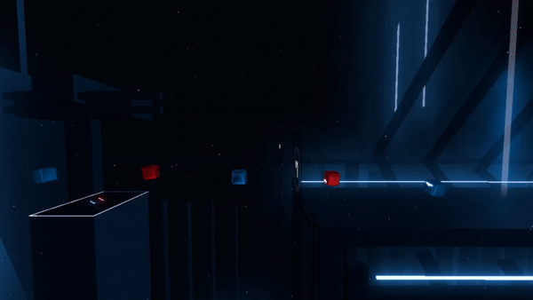
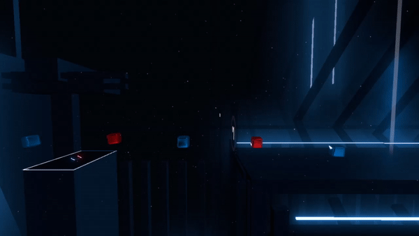
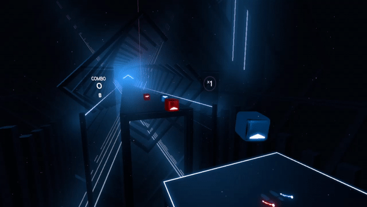
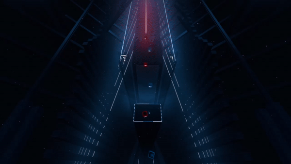
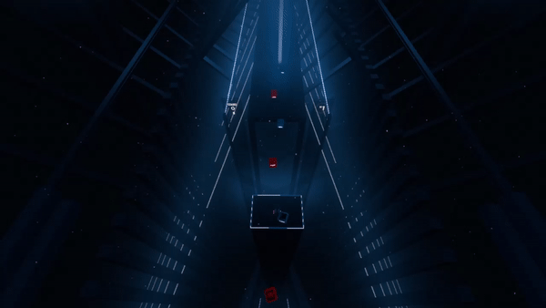
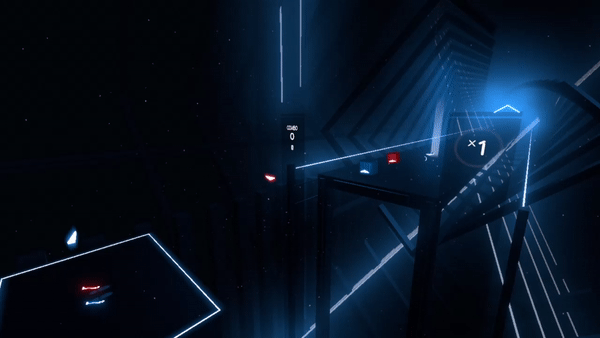
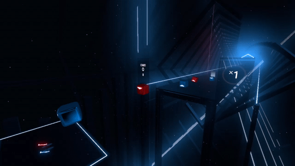
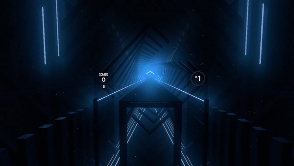

# Animation
This document covers animation for both Noodle Extensions and Chroma.

### You can find the script and map used to generate all the examples in the documentation [here](examples/documentationMap).

# Custom Events
Custom events are stored inside the `_customEvents` field of your `_customData`.
```js
{
  "_version": "2.0.0",
  "_customData": {
    "_customEvents": [
      {
        "_time": float,
        "_type": string,
        "_data": {
          "foo": 1.0,
          "message": "Hello from a custom event!"
        }
      }
    ]
  },
  "_events": [],
  "_notes": [],
  "_obstacles": []
}
```
## Event Types
- [`AnimateTrack`](#AnimateTrack)
- [`AssignPathAnimation`](#AssignPathAnimation)
- [`AssignTrackParent`](#AssignTrackParent)
- [`AssignPlayerToTrack`](#AssignPlayerToTrack)

# Tracks
`_track` is a string property in the `_customData` of the object you want to give said track to. It can be placed on any object in the `_obstacles` or `_notes` arrays.

This example will add the note to the `ExampleTrack` track. These tracks are a way of indentifying which objects that the custom events should affect.
```js
"_notes": [
  {
    "_time": 8.0,
    "_lineIndex": 2,
    "_lineLayer": 0,
    "_type": 1,
    "_cutDirection": 1,
    "_customData": {
      "_track": "ExampleTrack"
    }
  }
]
```

# Point Definitions
Point definitions are used to describe what happens over the course of an animation, they are used **slightly differently for different properties.** They consist of a collection of points over time.

Here is an example of one being defined to animate [`_position`](#_position): (See: [AnimateTrack](#AnimateTrack))
```js
{
  "_time": 3.0,
  "_type": "AnimateTrack",
  "_data": {
    "_track": "ZigZagTrack",
    "_duration": 1,
    "_position": [
      [0, 0, 0, 0],
      [1, 0, 0, 0.25],
      [-1, 0, 0, 0.75],
      [0, 0, 0, 1]
    ]
  }
}
```
A point definition usually follows the pattern of `[data, time, "optional easing", "optional spline"]`, 
- Data can be multiple points of data, this part of a point varies per property,
- Time is a float from 0 - 1, points must be ordered by their time values
- "optional easing" is an optional field, with any easing from easings.net (with the addition of `easeLinear` and `easeStep`). This is the easing that will be used in the interpolation from the last point to the one with the easing defined on it.
- "optional spline" is an optional field, with any spline implemented, currently only `"splineCatmullRom"`. It acts like easings, affecting the movement from the last point to the one with the spline on it. Currently only positions and rotations support splines.
```js
// Example of splines and easings being used
"_position": [
  [0, 0, 0, 0],
  [1, 5, 0, 0.5, "easeInOutSine"],
  [6, 0, 0, 0.75, "splineCatmullRom"],
  [5, -2, -1, 1, "easeOutCubic", "splineCatmullRom"]
]
```
Point definitions can also be defined inside the `_pointDefinitions` field of your `_customData`, any point definition defined here can be called via their `_name` when one would fit.
```js
{
  "_version": "2.0.0",
  "_customData": {
    "_pointDefinitions": [
	  {
       "_name": "ZigZagPosition",
        "_points":[
          [0, 0, 0, 0],
          [1, 0, 0, 0.25],
          [-1, 0, 0, 0.75],
          [0, 0, 0, 1]
        ]
      }
	],
	"_customEvents": [
	  {
        "_time": 3.0,
        "_type": "AnimateTrack",
        "_data": {
          "_track": "ZigZagTrack",
          "_duration": 1,
          "_position": "ZigZagPosition"
        }
      }
	]
  },
  "_events": [],
  "_notes": [],
  "_obstacles": []
}
```
When a point definition is used, input time values outside of the defined points' times will automatically clamp to the first and last values respectively.
```js
// The scale of this note will be 2x up until 0.5, after which it will begin scaling down to 1x until 0.8, after which the note will remain at 1x
{
  "_time": 2,
  "_lineIndex": 1,
  "_lineLayer": 0,
  "_type": 1,
  "_cutDirection": 0,
  "_customData": {
    "_animation": {
      "_scale": [
        [2, 2, 2, 0.5],
        [1, 1, 1, 0.8]
      ]
    }
  }
}
```

# AnimateTrack
```js
{
  "_time": float, // Time in beats.
  "_type": "AnimateTrack",
  "_data": {
    "_track": string, // The track you want to animate.
    "_duration": float, // The length of the event in beats (defaults to 0).
    "_easing": string, // An easing for the animation to follow (defaults to easeLinear).
    "_property": point definition // The property you want to animate.
  }
}
```
Animate track will animate the properties of everything on the track individually at the same time. The animation will go over the point definition over the course of `_duration`. 

Attempting to animate a property which is already being animated will stop the overwritten `AnimateTrack`. 

However, multiple `AnimateTrack` events may animate separate properties at the same time, i.e. one `AnimateTrack` could animate position over 10 beats while another `AnimateTrack` animates rotation over 5 beats.

Although not recommended, properties can be set to `null` to "erase" a track's property (This obviously cannot have a duration). This will return that property to as if it was never set at all. This is highly not recommended because it cannot update active objects and can instead be done by setting the property to a default point definition. i.e. `[[0,0,0,0]]`

## Track Properties
- [`_position`](#_position)
- [`_rotation`](#_rotation)
- [`_localRotation`](#_localRotation)
- [`_scale`](#_scale)
- [`_dissolve`](#_dissolve)
- [`_dissolveArrow`](#_dissolveArrow)
- [`_color`](#_color) (Chroma)
- [`_interactable`](#_interactable)
- [`_time`](#_time)

```js
// Example
// All the objects on ZigZagTrack will be offset 1 unit to the right, then offset 1 units to the left, and then finally centered.
{
  "_time": 3.0,
  "_type": "AnimateTrack",
  "_data": {
    "_track": "ZigZagTrack",
    "_duration": 10,
    "_position": [
      [0, 0, 0, 0],
      [1, 0, 0, 0.25],
      [-1, 0, 0, 0.75],
      [0, 0, 0, 1]
    ]
  }
}
```

# AssignPathAnimation
```js
{
  "_time": float, // Time in beats.
  "_type": "AssignPathAnimation",
  "_data": {
    "_track": string, // The track you want to animate.
    "_duration": float, // How long it takes to assign this path animation (defaults to 0).
    "_easing": string, // An easing for moving to the path animation (defaults to easeLinear).
    "_property": point definition // The property you want to assign the path to.
  }
}
```
`AssignPathAnimation` will assign a "path animation" to the notes. 

In this case, the time value of the point definition is the point each object on the track is at in its individual life span. 

Meaning a point with time `0` would be right when the object finishes jumping in, a point with time `0.5` would be when the object reaches the player, at `0.75`, walls and notes will begin their despawn animation and start flying away very quickly, and `1` being right when the object despawns.

**Note:** Objects CANNOT be animated while they are in their jumping animation. During that time, they will instead strictly use the first point in the point definition.

Although not recommended, path properties can be set to `null` to "erase" a track's path property. This will return that path property to as if it was never set at all. It is highly not recommended because although usually you can interpolate from one path animation to another using `_duration`, you cannot interpolate from `null`.

## Path Properties

- [`_position`](#_position)
- [`_rotation`](#_rotation)
- [`_localRotation`](#_localRotation)
- [`_scale`](#_scale)
- [`_dissolve`](#_dissolve)
- [`_dissolveArrow`](#_dissolveArrow)
- [`_color`](#_color) (Chroma)
- [`_interactable`](#_interactable)
- [`_definitePosition`](#_definitePosition)
```js
// Example
// During their jump animation, the objects will be 40 units high. Once their jump animation is complete, the object will then start descending.
{
  "_time": 3.0,
  "_type": "AssignPathAnimation",
  "_data": {
    "_track": "DropNotes",
    "_position": [
      [0, 40, 0, 0],
      [0, 0, 0, 0.2],
    ]
  }
}
```

# AssignTrackParent
```js
{
  "_time": float, // Time in beats.
  "_type": "AssignTrackParent",
  "_data": {
    "_childrenTracks": [string], // Array of tracks to parent to _parentTrack.
    "_parentTrack": string // The track you want to animate.
  }
}
```
`AssignTrackParent` will parent any number of children tracks to a single parent track. 

Only transform properties animated with [`AnimateTrack`](#AnimateTrack) will influence the parent. Those properties being:
- [`_position`](#_position)
- [`_rotation`](#_rotation)
- [`_localRotation`](#_rotation)

# AssignPlayerToTrack
```js
{
  "_time": float, // Time in beats.
  "_type": "AssignPlayerToTrack",
  "_data": {
    "_track": string // The track you wish to assign the player to.
  }
}
```
`AssignPlayerToTrack` will assign the player object to the specified `_track`. 

Only transform properties animated with [`AnimateTrack`](#AnimateTrack) will influence the player. Those properties being:
- [`_position`](#_position)
- [`_rotation`](#_rotation)
- [`_localRotation`](#_rotation)

### IT IS HIGHLY RECOMMENDED TO HAVE A TRACK DEDICATED TO THE PLAYER, AND NOT USE EASINGS IN MOVEMENT.
This is VR, non-linear movement or any form of rotation can easily cause severe motion sickness.
To clarify,
## It is very easy to make people motion sick with player tracks, please use them carefully and sparingly.

# Individual Path Animation
`_animation` is an object that can be put in the `_customData` of any object in the `_obstacles` or `_notes` array.

This will instantly apply a path animation to the object. See [`AssignPathAnimation`](#AssignPathAnimation). Will overwrite any path animation assigned through [`AssignPathAnimation`](#AssignPathAnimation)
```js
// Example
{
  "_time": 90,
  "_lineIndex": 1,
  "_lineLayer": 0,
  "_type": 0,
  "_cutDirection": 1,
  "_customData": {
    "_animation": {
      "_position": [
        [0, 40, 0, 0],
        [0, 0, 0, 0.2]
      ]
    }
  }
}
```

# Properties
- [`_position`](#_position)
- [`_rotation`](#_rotation)
- [`_localRotation`](#_localRotation)
- [`_scale`](#_scale)
- [`_dissolve`](#_dissolve)
- [`_dissolveArrow`](#_dissolveArrow)
- [`_interactable`](#_interactable)
- [`_color`](#_color) (Chroma)
- [`_interactable`](#_interactable)
- [`_definitePosition`](#_definitePosition) (EXCLUSIVE TO AssignPathAnimation)
- [`_time`](#_time) (EXCLUSIVE TO AnimateTrack)

# _position
`_position` may be used in both [`AnimateTrack`](#AnimateTrack) and [`AssignPathAnimation`](#AssignPathAnimation)

Describes the position **offset** of an object. It will continue any normal movement and have this stacked on top of it.

Track `_position` and path `_position` will be added together.

**Note:** One unit in `_position` is equal to the width of one lane.

Point definition: `[x, y, z, time, (optional)easing, (optional)spline]`

## Examples
```js
// Point Definition
{
  "_name": "examplePositionPointDef",
  "_points": [
    [0, 0, 0, 0],
    [0, 5, 0, 0.5, "splineCatmullRom"],
    [0, 0, 0, 1, "splineCatmullRom"]
  ]
}, {
  "_name": "examplePositionPath",
  "_points":[
    [0, 0, 0, 0],
    [0, 5, 0, 0.25, "splineCatmullRom"],
    [0, 0, 0, 0.5, "splineCatmullRom"]
  ]
}
```
```js
// AnimateTrack
{
  "_time": 4,
  "_type": "AnimateTrack",
  "_data": {
    "_track": "firstPositionDemo",
    "_duration": 8,
    "_position": "examplePositionPointDef"
  }
}
```
Above event results in:


```js
// AssignPathAnimation
{
  "_time": 12,
  "_type": "AssignPathAnimation",
  "_data": {
    "_track": "firstPositionDemo",
    "_duration": 4,
    "_easing": "easeInBounce",
    "_position": "examplePositionPath"
  }
}, {
  "_time": 16,
  "_type": "AssignPathAnimation",
  "_data": {
    "_track": "firstPositionDemo",
    "_duration": 4,
    "_easing": "easeOutBounce"
    "_position": [
      [0, 0, 0, 0]
    ]
  }
}
```
Above event results in:



# _localRotation
`_localRotation` may be used in both [`AnimateTrack`](#AnimateTrack) and [`AssignPathAnimation`](#AssignPathAnimation)

This property describes the **local** rotation offset of an object. This means it is rotated with itself as the origin. Uses euler values. Do note that the note spawn effect will be rotated accordlingly

Track `_localRotation`, path `_localRotation`, and standard `_localRotation` will be added together.

Point definition: `[pitch, yaw, roll, time, (optional)easing, (optional)spline]`

## Examples
```js
// Point Definition
{
  "_name": "localSpinDemoAnimate",
  "_points": [
    [0, 0, 0, 0],
    [90, 0, 0, 0.25],
    [180, 0, 0, 0.5],
    [270, 0, 0, 0.75],
    [360, 0, 0, 1]
  ]
}, {
  "_name": "localSpinDemoAnimateRev",
  "_points": [
    [0, 0, 0, 0],
    [-90, 0, 0, 0.25],
    [-180, 0, 0, 0.5],
    [-270, 0, 0, 0.75],
    [-360, 0, 0, 1]
  ]
}, {
  "_name": "localSpinDemoPath",
  "_points": [
    [0, 0, 0, 0],
    [0, 0, 90, 0.125],
    [0, 0, 180, 0.25],
    [0, 0, 270, 0.375],
    [0, 0, 360, 0.5]
  ]
}
```
```js
// AnimateTrack
{
  "_time": 20,
  "_type": "AnimateTrack",
  "_data": {
    "_track": "localRotationDemo",
    "_duration": 5,
    "_easing": "easeInOutExpo",
    "_localRotation": "localSpinDemoAnimate"
  }
}, {
  "_time": 25,
  "_type": "AnimateTrack",
  "_data": {
	"_track": "localRotationDemo",
    "_duration": 5,
    "_easing": "easeInOutExpo",
    "_localRotation": "localSpinDemoAnimateRev"
  }
}
```
Above event results in:


```js
// AssignPathAnimation
{
  "_time": 30,
  "_type": "AssignPathAnimation",
  "_data": {
    "_track": "localRotationDemo",
    "_localRotation": "localSpinDemoPath"
  }
}
```
Above event results in: 


# _rotation
`_rotation` may be used in both [`AnimateTrack`](#AnimateTrack) and [`AssignPathAnimation`](#AssignPathAnimation)

This property describes the **world** rotation offset of an object. This means it is rotated with **the world** as the origin. Uses euler values. Think of 360 mode.

Track `_rotation`, path `_rotation`, and standard `_rotation` will be added together.

Point definition: `[pitch, yaw, roll, time, (optional)easing]`

## Examples
```js
// Point Definition
{
  "_name": "RotationPointsAnimate",
  "_points": [
    [0, 0, 0, 0],
    [0, 90, 0, 0.25],
    [0, 180, 0, 0.5],
    [0, 270, 0, 0.75],
    [0, 360, 0, 1]
  ]
}, {
  "_name": "RotationPointsPath",
  "_points":[
    [0, 0, 0, 0],
    [0, 45, 0, 0.125, "splineCatmullRom"],
    [0, -45, 0, 0.25, "splineCatmullRom"],
    [0, 22.5, 0, 0.375, "splineCatmullRom"],
    [0, -22.5, 0, 0.5, "splineCatmullRom"],
    [0, 0, 0, 0.625, "splineCatmullRom"]
  ]
}
```
```js
// AnimateTrack
{
  "_time": 40,
  "_type": "AnimateTrack",
  "_data":{
    "_track": "RotationDemo",
    "_duration": 10,
    "_rotation": "RotationPointsAnimate"
  }
}
```
Above event results in:


```js
// AssignPathAnimation
 {
  "_time": 50,
  "_type": "AssignPathAnimation",
  "_data": {
    "_track": "RotationDemo",
    "_duration": 5,
    "_rotation": "RotationPointsPath"
  }
}, {
  "_time": 55,
  "_type": "AssignPathAnimation",
  "_data": {
    "_track": "RotationDemo",
    "_duration": 5,
    "_rotation":[
		[0, 0, 0, 0]
	]
  }
}
```
Above event results in:




# _scale
`_scale` may be used in both [`AnimateTrack`](#AnimateTrack) and [`AssignPathAnimation`](#AssignPathAnimation)

Decribes the scale of an object. This will be based off their initial size. A scale of 1 is equal to normal size, anything under is smaller, over is larger.

Track `_scale` and path `_scale` will be multiplied.

Point definition: `[x, y, z, time, (optional)easing, (optional)spline]`
## Examples

```js
// Point Definition
{
  "_name": "AnimateTrackScale",
  "_points": [
    [1, 1, 1, 0],
    [0.80, 0.80, 0.80, 0.15, "easeOutCirc"],
    [2, 2, 2, 0.5, "easeOutBounce"],
    [2, 2, 2, 0.6],
    [2.5, 1, 1, 0.8, "easeOutExpo"],
    [1, 1, 1, 1, "easeOutBounce"]
  ]
}, {
  "_name": "PathScale",
  "_points": [
    [1, 1, 1, 0],
    [4, 0.5, 1, 0.20, "easeInElastic"],
    [1, 1, 1, 0.50, "easeOutElastic"]
  ]
}
```
```js
// AnimateTrack
{
  "_time": 165,
  "_type": "AnimateTrack",
  "_data": {
    "_track": "scaleTrack",
    "_scale": "AnimateTrackScale",
    "_duration": 5
  }
}
```
Above event results in:


```js
// AssignPathAnimation
{
  "_time":175,
  "_type":"AssignPathAnimation",
  "_data":{
    "_track":"scaleTrack",
    "_scale":"PathScale"
  }
}
```
Above event results in:


# _dissolve
`_dissolve` may be used in both [`AnimateTrack`](#AnimateTrack) and [`AssignPathAnimation`](#AssignPathAnimation)

This property controls the dissolve effect on both notes and walls. It's the effect that happens when things go away upon failing a song. **Keep in mind that notes and the arrows on notes have seperate dissolve properties**, see [`_dissolveArrow`](#_dissolveArrow) 

**Note**: How this looks will depend on the player's graphics settings. 

`0` is fully transparent and `1` is fully opaque.

Track `_dissolve` and path `_dissolve` will be multiplied together.

Point definition: `[transparency, time, (optional)easing]`

It is possible to "disable" the jump animation when objects cannot be animated.

```js
// This note will be invisible during the jump animation.
// Remember that if you want the note to be invisible for longer, you should use Chroma's _disableSpawnEffect to hide the spawn effect.
{
  "_time": 60,
  "_lineIndex": 1,
  "_lineLayer": 0,
  "_type": 0,
  "_cutDirection": 1,
  "_customData": {
	"_disableSpawnEffect": true,
    "_animation": {
      "_dissolve": [
        [0, 0],
        [1, 0],
      ]
    }
  }
}
```

## Examples
```js
// Point Definition
{
  "_name": "dissolveDemoAnimate",
  "_points": [
    [1, 0],
    [0, 0.25],
    [0.5, 0.50],
    [0, 0.75],
    [1, 1]
  ]
}, {
  "_name": "dissolveDemoPath",
  "_points": [
    [0, 0],
    [1, 0.125],
    [1, 0.30],
    [0, 0.35]
  ]
}
```
```js
// AnimateTrack
{
  "_time": 60,
  "_type": "AnimateTrack",
  "_data": {
    "_track": "dissolveDemo",
    "_duration": 10,
    "_dissolve": "dissolveDemoAnimate"
  }
}
```
Above event results in:


```js
// AssignPathAnimation
{
  "_time": 70,
  "_type": "AssignPathAnimation",
  "_data": {
    "_track": "dissolveDemo",
    "_dissolve": "dissolveDemoPath"
  }
}
```
Above event results in:



# _dissolveArrow
`_dissolveArrow` may be used in both [`AnimateTrack`](#AnimateTrack) and [`AssignPathAnimation`](#AssignPathAnimation)

This property controls the dissolve effect on the arrows of notes. Similar to the look of the disappearing notes modifier.

This property has no effect on obstacles.

Track `_dissolveArrow` and path `_dissolveArrow` will be multiplied together.

Point definition: `[transparency, time, (optional)easing]`

## Examples
```js
// Point Definition
{
  "_name": "dissolveArrowDemoAnimate",
  "_points": [
    [1, 0],
    [0, 1]
  ]
}, {
  "_name": "dissolveArrowDemoPath",
  "_points": [
    [0, 0.10],
    [1, 0.20],
    [1, 0.30],
    [0, 0.35]
  ]
}
```
```js
// AnimateTrack
{
  "_time": 80,
  "_type": "AnimateTrack",
  "_data": {
    "_track": "dissolveArrowDemo",
    "_duration": 5,
    "_dissolveArrow": "dissolveArrowDemoAnimate"
  }
}, {
  "_time": 85,
  "_type": "AnimateTrack",
  "_data": {
    "_track": "dissolveArrowDemo",
    "_duration": 5,
    "_dissolveArrow": [
      [0, 0],
      [1, 1]
    ]
  }
}
```
Above event results in:


```js
// AssignPathAnimation
{
  "_time": 90,
  "_type": "AssignPathAnimation",
  "_data": {
    "_track": "dissolveArrowDemo",
    "_dissolveArrow": "dissolveArrowDemoPath"
  }
}
```


# _color
`_color` may be used in both [`AnimateTrack`](#AnimateTrack) and [`AssignPathAnimation`](#AssignPathAnimation)

### WARNING: THIS PROPERTY IS IMPLEMENTED BY CHROMA AND REQUIRES CHROMA TO FUNCTION

Describes the color of an object. Will override any other color the object may have had.

Color is on a scale from 0 - 1, and NOT 0 - 255.

Track `_color` and path `_color` will be multiplied together.

Point definition: `[red, green, blue, alpha, time, (optional)easing]`

## Examples
```js
// Point Definition
{
  "_name": "RightColorWallAnimate",
  "_points": [
    [1, 0, 0, 1, 0.2],
    [0, 1, 0, 1, 0.4],
    [0, 0, 1, 1, 0.6],
    [0, 1, 1, 1, 0.8],
    [1, 1, 1, 1, 1]
  ]
}, {
  "_name": "LeftColorWallAnimate",
  "_points": [
    [1, 0, 0, 0, 0.2],
    [0, 1, 0, 0, 0.4],
    [0, 0, 1, 0, 0.6],
    [0, 1, 1, 0, 0.8],
    [1, 1, 1, 0, 1]
  ]
}, {
  "_name": "GradientPathOne",
  "_points": [
    [1, 0, 0, 0.5, 0.0416],
    [0, 1, 0, 0.5, 0.0832],
    [0, 0, 1, 0.5, 0.1248],
    [1, 0, 0, 0.5, 0.1664],
    [0, 1, 0, 0.5, 0.208],
    [0, 0, 1, 0.5, 0.2496],
    [1, 0, 0, 0.5, 0.2912],
    [0, 1, 0, 0.5, 0.3328],
    [0, 0, 1, 0.5, 0.3743],
    [1, 0, 0, 0.5, 0.416],
    [0, 1, 0, 0.5, 0.4576],
    [0, 0, 1, 0.5, 0.4992]
  ]
}, {
  "_name": "GradientPathTwo",
  "_points": [
    [0, 1, 0, 0.5, 0.0416],
    [0, 0, 1, 0.5, 0.0832],
    [1, 0, 0, 0.5, 0.1248],
    [0, 1, 0, 0.5, 0.1664],
    [0, 0, 1, 0.5, 0.208],
    [1, 0, 0, 0.5, 0.2496],
    [0, 1, 0, 0.5, 0.2912],
    [0, 0, 1, 0.5, 0.3328],
    [1, 0, 0, 0.5, 0.3743],
    [0, 1, 0, 0.5, 0.416],
    [0, 0, 1, 0.5, 0.4576],
    [1, 0, 0, 0.5, 0.4992]
  ]
}
```
```js
// AnimateTrack
{
  "_time": 98,
  "_type": "AnimateTrack",
  "_data": {
    "_track": "RightColorWall",
    "_color": "RightColorWallAnimate",
    "_duration": 10
  }
}, {
  "_time": 98,
  "_type": "AnimateTrack",
  "_data": {
    "_track": "LeftColorWall",
    "_color": "LeftColorWallAnimate",
    "_duration": 10
  }
}
```
Above event results in:


```js
// AssignPathAnimation
{
  "_time": 110,
  "_type": "AssignPathAnimation",
  "_data": {
    "_track": "RightColorWallStatic",
    "_duration": 2,
    "_color": "GradientPathOne"
  }
}, {
  "_time": 114,
  "_type": "AssignPathAnimation",
  "_data": {
    "_track": "RightColorWallStatic",
    "_duration": 6,
    "_easing": "easeOutElastic",
    "_color": "GradientPathTwo"
  }
}, {
  "_time": 110,
  "_type": "AssignPathAnimation",
  "_data": {
    "_track": "LeftColorWallStatic",
    "_duration": 2,
    "_color": "GradientPathTwo"
  }
}, {
  "_time": 114,
  "_type": "AssignPathAnimation",
  "_data": {
    "_track": "LeftColorWallStatic",
    "_duration": 6,
    "_easing": "easeOutElastic",
    "_color": "GradientPathOne"
  }
}
```
Above event results in:


# _interactable
`_interactable` may be used in both [`AnimateTrack`](#AnimateTrack) and [`AssignPathAnimation`](#AssignPathAnimation)

This property controls whether or not the player can interact with the note/wall. 

`_interactable` either is or isn't, there is no inbetween. When great than or equal to `1`, the object can fully be interacted with. When less than `1`, the object cannot be interacted with at all.

Track `_interactable` and path `_interactable` will be multiplied together.

Point definition: `[interactable, time, (optional)easing]`

## Examples
```js
// Point Definition
{
// neat example goes here
}
```
```js
// AnimateTrack
{
// neat example goes here
}
```
Above event results in:

(cool gif goes here)

```js
{
// neat example goes here
}
```
Above event results in:

(cool gif goes here)

# _definitePosition
`_definitePosition` may be used in [`AssignPathAnimation`](#AssignPathAnimation)

Describes the **definite** position of an object. Will completely overwrite the object's default movement. However, this does take into account lineIndex/lineLayer and world rotation.

An object with with `_definitePosition` will still be offset by the `_position` property.

**Note:** One unit in `_definitePosition` is equal to the width of one lane.

Point definition: `[x, y, z, time, (optional)easing, (optional)spline]`

## Examples
```js
// Definite Position
{ 
  "_name": "defPosPath",
  "_points":[
    [0, 0, 20, 0],
    [10, 0, 20, 0.1],
    [10, 10, 20, 0.2],
    [0, 10, 20, 0.3],
    [0, 0, 20, 0.4],
    [0, 0, 10, 0.5],
    [-20, 0, 10, 1.0]
  ]
}, {
  "_name":"defPosNormal",
  "_points":[
    [0,0,23,0],
    [0,0,0,0.5],
    [0,0,-23,1]
  ]
}
```
```js
{
  "_time":0,
  "_type":"AssignPathAnimation",
  "_data":{
    "_track":"definitePosDemo",
    "_definitePosition":"defPosNormal",
    "_duration":0
  }
}, {
  "_time":132,
  "_type":"AssignPathAnimation",
  "_data":{
    "_track":"definitePosDemo",
    "_definitePosition":"defPosPath",
    "_duration":3
  }
}
```
Above event results in:


# _time
`_time` may be used in [`AnimateTrack`](#AnimateTrack)

`_time` is relatively advanced so make sure to have a solid understanding of Noodle Extensions before delving into time. `_time` can only be used in [`AnimateTrack`](#AnimateTrack) as it lets you control what point in the note's "lifespan" it is at a given time using [`AnimateTrack`](#AnimateTrack). 

```js
// Example
[
  [0, 0],
  [0.2, 0.2],
  [0.3, 0.4],
  [0.4, 0.4]
]
```

It is worth noting that every object on one track will get the same time values when animating this property. This means they would suddenly appear to all be at the same point. **It is recommended for every object to have its own track when using `_time`**

Say you want a time AnimateTrack on an object that will make it behave normally for starters. You want the AnimateTrack to start *right when the object spawns*, meaning `_time-halfJumpDurationInBeats` of the object. It's duration should be `halfJumpJurationInBeats*2`. With this, the point definition of 
```js
[
  [0, 0],
  [1, 1]
]
```
would behave as normal. 
```js
[
  [0, 0],
  [0.45, 0.15],
  [0.15, 0.30],
  [0.5, 0.5],
  [1, 1]
]
```
would appear to go forwards, then backwards.

**Note:** If you intend to despawn an object using `_time`, obstacles require a time that is >1 while note require a time that is >=1.

Point definition: `[time, time, (optional)easing]`

## Examples
It is highly recommended you script/automate anything involving time. This is simply showcasing on one note to help visualize.
```js
// Point Definitions
"_pointDefinitions": [
  {
    "_name": "SingleNoteTime",
    "_points": [
      [0, 0],
      [0.45, 0.15],
      [0.15, 0.30],
      [0.5, 0.5],
      [1, 1]
    ]
  }
]
```
```js
// AnimateTrack
{
  "_time": 153,
  "_type": "AnimateTrack",
  "_data": {
    "_time": "SingleNoteTime",
    "_duration": 10,
    "_track": "singleNoteTimeTrack"
  }
}
```
Above event results in:


